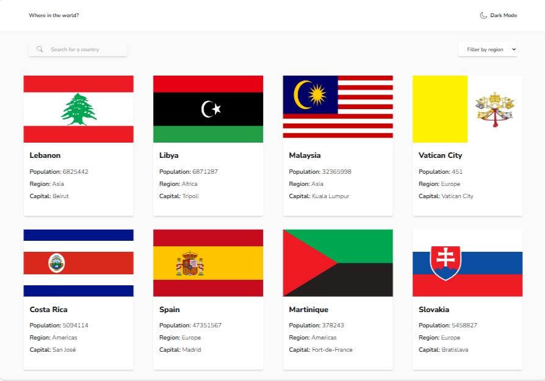

# Frontend Mentor - REST Countries API with color theme switcher solution

This is a solution to the [REST Countries API with color theme switcher challenge on Frontend Mentor](https://www.frontendmentor.io/challenges/rest-countries-api-with-color-theme-switcher-5cacc469fec04111f7b848ca). Frontend Mentor challenges help you improve your coding skills by building realistic projects.

## Table of contents

- [Overview](#overview)
  - [The challenge](#the-challenge)
  - [Screenshot](#screenshot)
  - [Links](#links)
- [My process](#my-process)
  - [Built with](#built-with)
  - [What I learned](#what-i-learned)
- [Author](#author)

**Note: Delete this note and update the table of contents based on what sections you keep.**

## Overview

### The challenge

Users should be able to:

- See all countries from the API on the homepage
- Search for a country using an `input` field
- Filter countries by region
- Click on a country to see more detailed information on a separate page
- Click through to the border countries on the detail page
- Toggle the color scheme between light and dark mode _(optional)_

### Screenshot



### Links

- Solution URL: [Add solution URL here](https://your-solution-url.com)
- Live Site URL: [Add live site URL here](https://your-live-site-url.com)

## My process

### Built with

- Semantic HTML5 markup
- CSS custom properties
- Flexbox
- CSS Grid
- Mobile-first workflow
- Tailwind CSS
- [React](https://reactjs.org/) - JS library

### What I learned

How to custom tailwind css

```css
@layer utilities {
  .dark-mode {
    @apply bg-FEDarkBlue text-FEWhite;
  }
  .light-mode {
    @apply bg-FEVeryLightGrayBg text-FEDarkBlueText;
  }
  .light-mode-whitebg {
    @apply bg-FEWhite text-FEDarkBlueText;
  }
}
```

```jsx
return (
  <div
        className={` ${
          darkMode ? " bg-FEVeryDarkBlue text-FEWhite" : "light-mode"
        } h-screen  pt-4 px-6 font-light lg:px-20`}
      >
)
```

Change color of svg using fill

```jsx
<svg
            onClick={clickSearch}
            className=" fill-slate-500 cursor-pointer"
            xmlns="http://www.w3.org/2000/svg"
            viewBox="0 0 50 50"
            width="20px"
            height="20px"
          >
```

## Author

- Github - [Atikah](https://github.com/atikahnaz)
- Frontend Mentor - [@atikahnaz](https://www.frontendmentor.io/profile/atikahnaz)
